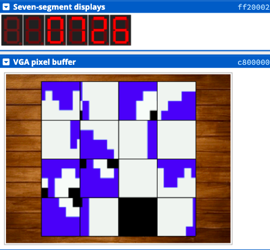

# Sliding Puzzle Game

 A sliding puzzle game to be implemented on a DE1-SoC Computer. Source code included in the repository.  
CPUlator can also be used to load the game: https://cpulator.01xz.net/?sys=arm-de1soc

 <b>Developers:</b> Paula Perdomo and Nicholas Short  
<b>ECE243 Computer Organization - 2021 Academic Year </b>

The game has multiple game modes and celebratory animation for when the user wins. Makes use of the:
- VGA display for game graphics.
- A9 private timer to track the user duration. 
- Hex Displays for timer display.
- Keyboard input for tile usage
- Interrupts for signal processing. 

# To play Sliding Puzzle Game...

 The game starts with a loading screen displayed on the VGA while the program precomputes some animation data. <b>Controls of the game for moving the tiles are the WASD keys.</b> 
 A: Left, S: Down, D: Right, W: Up. 
The timer runs when Play Mode starts, tracking your time. Try to solve it quickly!

While in the main menu: 
- <b>Push key 1:</b> To play the game with a 4x4 grid size.  
- <b>Push key 2:</b> To play the game with a 5x5 grid size (difficult level).

While in play mode:
- <b>Push key 0:</b> To return to the main menu.
- <b>Push key 3:</b> To quit the game.
When the puzzle is solved, you have won the game! <b>Let’s celebrate with fireworks!</b>

